# Real-Time Anomaly Detection Platform

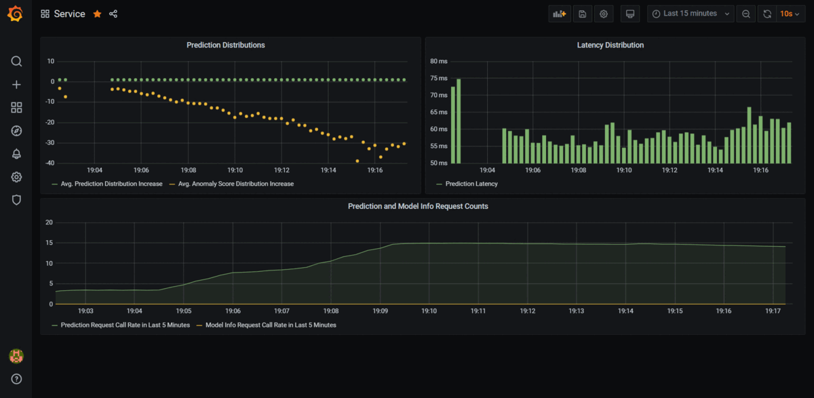

## Contents
1. [Software Requirements](https://github.com/koushikvikram/anomaly-detection-platform#software-requirements)
2. [Install `make` on Windows](https://github.com/koushikvikram/anomaly-detection-platform#install-make-on-windows)
3. [Platform Architecture](https://github.com/koushikvikram/anomaly-detection-platform#platform-architecture)
4. [How To Run The Platform](https://github.com/koushikvikram/anomaly-detection-platform#how-to-run-the-platform)
5. [Makefile Documentation](https://github.com/koushikvikram/anomaly-detection-platform#makefile-documentation)
6. [API Documentation](https://github.com/koushikvikram/anomaly-detection-platform#api-documentation)
7. [Acknowledgment](https://github.com/koushikvikram/anomaly-detection-platform#acknowledgment)

## Software Requirements

You'll need the following sofware to run the Anomaly Detection Platform.
<details>
<summary> Python 3.x </summary>

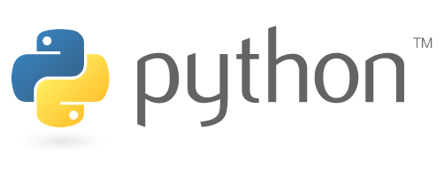

Python is an interpreted high-level general-purpose programming language. Its design philosophy emphasizes code readability with its use of significant indentation. Its language constructs as well as its object-oriented approach aim to help programmers write clear, logical code for small and large-scale projects.

Python comes pre-installed with most Linux and Mac Systems. To install Python, follow the instructions provided here: https://www.python.org/downloads/

Please make sure you install a version of Python 3.x
</details>

<details>
<summary> Git BASH (for Windows users) </summary>


Git BASH is an application for Microsoft Windows environments which provides an emulation layer for a Git command line experience.

Install Git BASH if you're on a Windows machine by following the instructions here: https://gitforwindows.org/

</details>

<details>
<summary> make </summary>

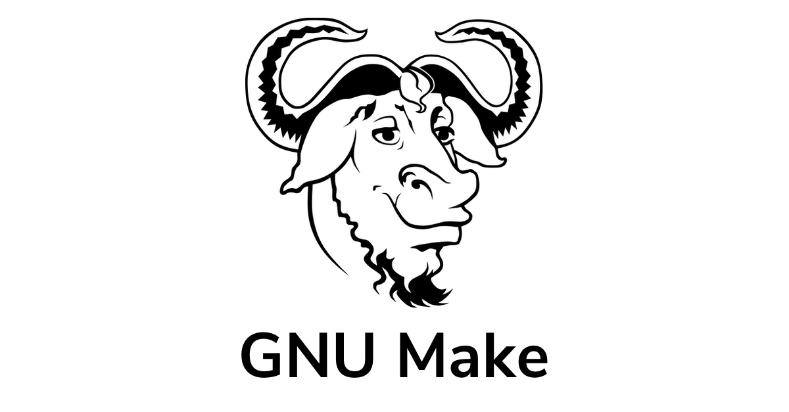

GNU Make is a tool which controls the generation of executables and other non-source files of a program from the program's source files.

Follow the instructions in the [Install make on Windows](https://github.com/koushikvikram/anomaly-detection-platform#install-make-on-windows) section to install `make` on Windows. 

To install `make` on Linux, follow the instructions listed on GNU's website: https://www.gnu.org/software/make/
</details>

<details>
<summary> Docker </summary>


Docker is a set of platform as a service products that use OS-level virtualization to deliver software in packages called containers.

To install Docker, follow the instructions listed on Docker's website: https://docs.docker.com/desktop/#download-and-install
</details>

## Install `make` on Windows

Windows does not support makefiles natively. So, we need to first install the `chocolatey package manager` before installing `make`.

### Steps to Install chocolatey/choco on Windows 10
1. Click Start and type "powershell"
2. Right-click Windows Powershell and choose "Run as Administrator"
3. Paste the following command into Powershell and press enter.
```bash
Set-ExecutionPolicy Bypass -Scope Process -Force; `iex ((New-Object System.Net.WebClient).DownloadString('https://chocolatey.org/install.ps1'))
```
4. Answer Yes when prompted
5. Close and reopen an elevated PowerShell window (Run as Administrator) to start using choco.

Source: [How to install chocolatey/choco on Windows 10 by JC](https://jcutrer.com/windows/install-chocolatey-choco-windows10)

Now, Run the following command in Powershell to install `make` and you can start using `make` in either the Command Prompt, Powershell or Git Bash:
```
choco install make
```

## Platform Architecture

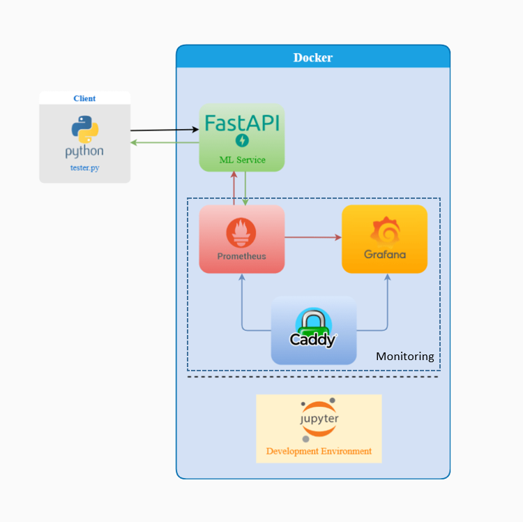

Our Platform is built using the following tools:
- [JupyterLab](https://jupyter.org/) - An extensible environment for interactive and reproducible computing, based on the Jupyter Notebook and Architecture.
- [FastAPI](https://fastapi.tiangolo.com/) - FastAPI is a Web framework for developing RESTful APIs in Python.
- [Caddy](https://caddyserver.com/) - The Caddy web server is an extensible, cross-platform, open-source web server written in Go. The name "Caddy" refers both to a helper for tedious tasks, and a way to organize multiple parts into a simplified system.
- [Prometheus](https://prometheus.io/) - Prometheus is a free software application used for event monitoring and alerting. 
- [Grafana](https://grafana.com/) - Grafana is a multi-platform open source analytics and interactive visualization web application. It provides charts, graphs, and alerts for the web when connected to supported data sources.

## How To Run The Platform

> We've done our development and testing on Windows 10 and used `Git Bash` to execute the commands and we recommend running Docker Engine as Administrator.

> However, you shouldn't have any problem running the Platform on any other Operating System.

To watch a demo of the Real-Time Anomaly Detection Platform, execute the steps below.
1. Clone this repository to your local computer. Alternatively, you can download the code as a zip file and extract it.
2. Open Git Bash if you're on Windows or the Terminal if you're on Mac/Linux.
3. `cd` into the `anomaly-detection-platform` directory.
4. Open `Makefile` and set the variables `DATASET_PATH` and `DOCKER_COMPOSE_PATH`.
5. Run the platform using the command `make run-platform`.
6. Wait for docker to create/pull the necessary images and build all the containers. Upon completion, you should see the URLs to access the Prediction API, Prometheus and Grafana services.
7. On your browser, access Grafana by gooing to the URL: `http://localhost:3000/?orgId=1`
8. If prompted for Username and Password, use **admin** and **admin** respectively to login.
9. Then, go to Dashboards -> Manage 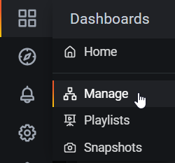
10. Click on the dashboard named **Service**.
11. On the top-right corner, set **Relative Time Range** to 15 minutes and **Refresh** to 10s. 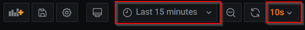
12. Back on the Terminal/Git Bash, run `make test-platform` if you're on Windows. On Mac/Linux, use `make test-platform OS=other`.
13. This should build a Python Virtual Environment on your local machine and run the *tester.py* script. Once you start seeing predictions on your terminal like the following: 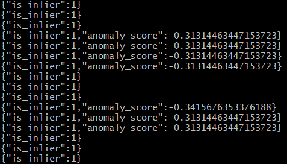, switch back to Grafana on you browser and you should see the Prometheus metrics being tracked in real-time as long as *tester.py* is running.
14. We're making only 1000 requests in *tester.py*. If you want the test to run longer, comment out 
```python
test_dataset[:1000].apply(predict, axis=1)
```
in *tester/tester.py* and uncomment the following line:
```python
# test_dataset.apply(predict, axis=1) # uncomment to predict on full test set
```
15. Once the simulation is done, it's time to clean up. First, stop the platform using the command `make stop-platform`.
16. Then, clean up `__pycache__` and the Python Virtual Environment using the command `make remove-env`.
17. Finally, clean up the platform's docker images and containers by running the command `make remove-all`.

## Makefile Documentation

| Target        | Utility                                                          |
|:--------------|:-----------------------------------------------------------------|
| help          | Lists all targets in this Makefile along with their descriptions |
| run-jupyter   | Build and Run a Jupyter Lab Container                            |
| build-api     | Build the Prediction API Docker Image                            |
| run-api       | Build and Run a Prediction API Container                         |
| run-platform  | Build and Run the entire Platform                                |
| run-all       | Run the Platform and the Jupyter Lab Container                   |
| stop-jupyter  | Kill and Delete the Jupyter Lab Container                        |
| stop-api      | Kill and Delete the Prediction API Container                     |
| stop-all      | Stop the Platform and the Jupyter Lab Container                  |
| remove-all    | Remove all the Docker images we've created                       |
| test-platform | Create Python Virtual Environment, run the tester script and visualize output in Grafana |
| remove-env    | Delete the Python Virtual Environment created for testing        |

We recommend running `make` commands in `run`-`stop` pairs.

If you'd like to experiment with a different dataset or model, feel free to spin up a JupyterLab container by running the command, `make run-jupyter`. Once you're done with development, make sure to stop the container using the command `make stop-jupyter`.

To test the Prediction API, run `make run-api` and go to `http://localhost:8000/docs`. For each endpoint, you should have a button named `Try it out`. Click on it and then press `Execute`. Make sure that the data is in the right format when you make a `POST` request. Do make sure to stop the Prediction API container when you're done using the command `make stop-api`.

## API Documentation

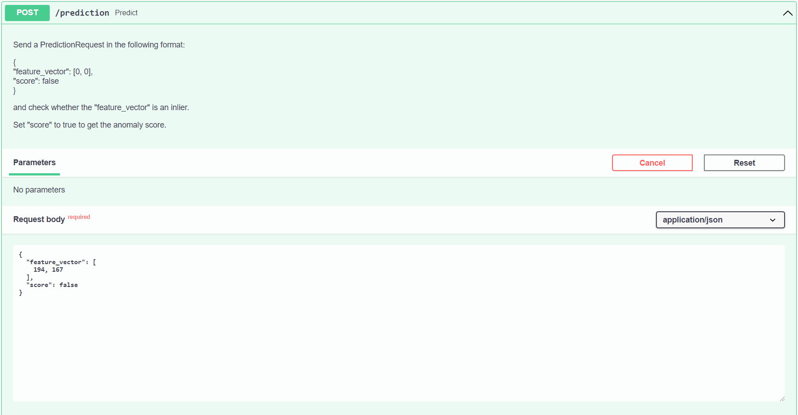
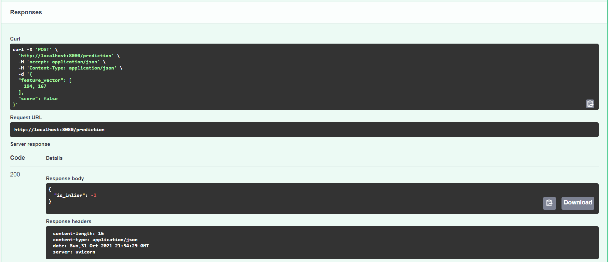
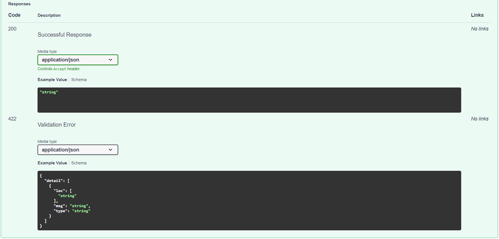
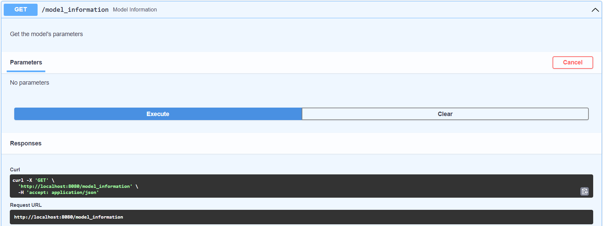
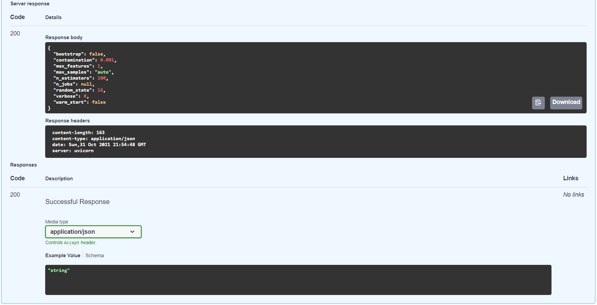

### CURL Command for `/prediction`:

```bash
curl -X 'POST' \
  'http://localhost:8080/prediction' \
  -H 'accept: application/json' \
  -H 'Content-Type: application/json' \
  -d '{
  "feature_vector": [
    194, 167
  ],
  "score": false
}'
```

Replace values for `"feature_vector"` with your input values for mean and standard deviation.

Set `"score": true` if you want `anomaly_score` included in the output.

### CURL Command for `/model_information`:

```bash
curl -X 'GET' \
  'http://localhost:8080/model_information' \
  -H 'accept: application/json'
```

## Acknowledgment

Articles and videos used as reference are documented in the [reference](https://github.com/koushikvikram/anomaly-detection-platform/tree/main/reference) directory.

If you run into issues while testing the platform, please create an issue on this GitHub repository at the following link and I'll be glad to fix it: https://github.com/koushikvikram/anomaly-detection-platform/issues

If you'd like to collaborate with me or hire me, please feel free to send an email to koushikvikram91@gmail.com

Make sure to check out other repositories on my [homepage](https://github.com/koushikvikram).