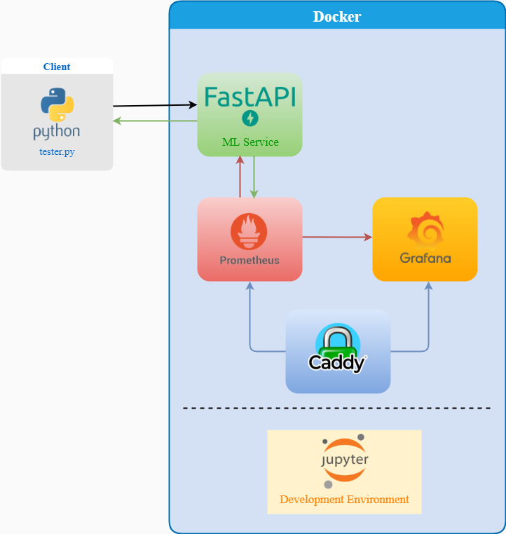

# A Real-Time Anomaly Detection Platform

> 🚦⚠️👷‍♂️🏗️ Repo Under Construction 🚦⚠️👷‍♂️🏗️


> We've done our development and testing on Windows 10 and used `Git Bash` to run our commands.

## Software Requirements

You'll need the following sofware to execute this project.
<details>
<summary> make </summary>


GNU Make is a tool which controls the generation of executables and other non-source files of a program from the program's source files.

Follow the instructions in the [Install make on Windows](https://github.com/koushikvikram/anomaly-detection-platform#install-make-on-windows) section to install `make` on Windows. 

To install `make` on Linux, follow the instructions listed on GNU's website: https://www.gnu.org/software/make/
</details>

<details>
<summary> Docker </summary>


Docker is a set of platform as a service products that use OS-level virtualization to deliver software in packages called containers.

To install Docker, follow the instructions listed on Docker's website: https://docs.docker.com/desktop/#download-and-install
</details>


## Platform Architecture



## Makefile Documentation

| Target        | Utility                                                          |
|:--------------|:-----------------------------------------------------------------|
| help          | Lists all targets in this Makefile along with their descriptions |
| run-jupyter   | Build and Run a Jupyter Lab Container                            |
| run-api       | Build and Run a Prediction API Container                         |
| run-all       | Run all containers                                               |
| stop-jupyter  | Kill and Delete the Jupyter Lab Container                        |
| stop-api      | Kill and Delete the Prediction API Container                     |
| stop-all      | Stop all containers                                              |
| remove-all    | Remove all Docker images                                         |


Build the image with jupyter lab using the command

```bash
docker build -t koushik/anomaly-platform-jupyter --file jupyter\Dockerfile .
```

Run the Docker image using the command

```bash
docker run -d -p 8888:8888 -e JUPYTER_TOKEN="dummytoken" koushik/anomaly-platform-jupyter
```

Then, go to `http://localhost:8888/` in your browser and type in the value you set for `JUPYTER_TOKEN` to enter Jupyter Lab. 

If you don't pass in `JUPYTER_TOKEN`, you'll have to run Docker in Foreground mode (without `-d`) to get the token for Jupyter Lab.

To make the training and test data available inside the Docker container, we need to "mount" the `jupyter` directory which contains the training and test datasets into the container.

We can mount the `jupyter` directory into the container's working directory, `/src/` by using the command

```bash
docker run -d -p 8888:8888 -e JUPYTER_TOKEN="dummytoken" --mount type=bind,source=D:/projects/anomaly-detection-platform/jupyter,target=/src/ koushik/anomaly-platform-jupyter
```

Some things to note here:
- The container name `koushik/anomaly-platform-jupyter` has to come after all the arguments
- The `source` key in the `--mount` argument requires the **absolute** path in the host machine 
- There should be no space between the keys for the `--mount` argument

Now, when we enter Jupyter Lab inside the container, we see that the train and test files are available to us.

## Install `make` on Windows

Windows does not support makefiles natively. So, we need to first install the `chocolatey package manager` before installing `make`.

### Steps to Install chocolatey/choco on Windows 10
1. Click Start and type "powershell"
2. Right-click Windows Powershell and choose "Run as Administrator"
3. Paste the following command into Powershell and press enter.
```bash
Set-ExecutionPolicy Bypass -Scope Process -Force; `iex ((New-Object System.Net.WebClient).DownloadString('https://chocolatey.org/install.ps1'))
```
4. Answer Yes when prompted
5. Close and reopen an elevated PowerShell window (Run as Administrator) to start using choco.

Source: [How to install chocolatey/choco on Windows 10 by JC](https://jcutrer.com/windows/install-chocolatey-choco-windows10)

Now, Run the following command in Powershell to install `make` and you can start using `make` in either the Command Prompt or Powershell:
```
choco install make
```


## API Documentation


### CURL Command for `/prediction`:

```bash
curl -X 'POST' \
  'http://localhost:8080/prediction' \
  -H 'accept: application/json' \
  -H 'Content-Type: application/json' \
  -d '{
  "feature_vector": [
    194, 167
  ],
  "score": false
}'
```

Replace values for `"feature_vector"` with your input values for mean and standard deviation.

Set `"score": true` if you want `anomaly_score` included in the output.

### CURL Command for `/model_information`:

```bash
curl -X 'GET' \
  'http://localhost:8080/model_information' \
  -H 'accept: application/json'
```